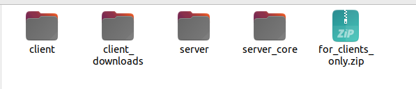
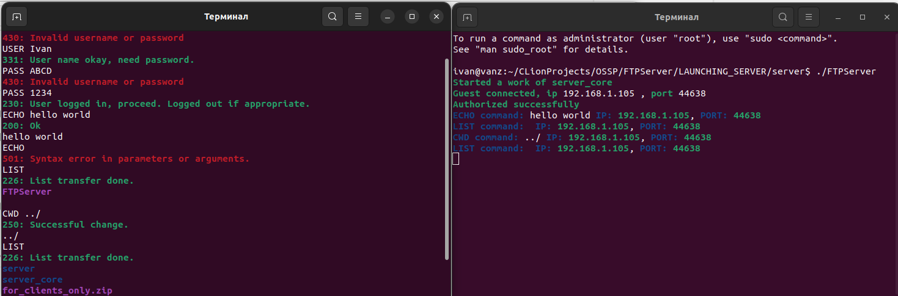

# A simple multithreaded FTP-server that works with a custom client, which is also implemented here.

This server does not work with ready-made clients, due to disagreements with the specifications in different clients, but it works with acustom client. Therefore, based on this code, you can implement something better. 

## Table of Contents

- [Introduction](#introduction)
- [Installation](#installation)
- [Usage](#usage)
- [Warnings](#warnings)

## Introduction

This server-client is not cross-platform, it is designed exclusively for UNIX systems, and we can use it on the Linux and MacOS family. This project was developed solely for educational purposes and taught me how to work directly with bare sockets and gave me a general understanding of servers. There are probably a lot of mistakes here, but it was a very useful experience.

## Installation

In this project, I have attached a CMakeFile and you need to use the cmake utility to build this project. The cmake itself contains both a separate build for the client and for the server. Be careful with the project structure, it should be the same as in the repository. If you want to change directories and catalogs, do not be lazy then change all #include "". For example, if you want to change the directory where the client will save files from the server, you must change #define PATH_TO_JSON "../server_core/resources/config.json"
#define PATH_TO_DOWNLOADS "../client_downloads"

````
Check LAUNCHING_SERVER directory, o understand how executable files should be located 
and in which directories relative to other files and directories.
(The names of the directories are also important)
````



## Usage

```bash
USER Ivan
```
```bash
PASS 1234
```
```bash
LIST
```
```bash
CWD ../../
```
```bash
RETR filename
```
```bash
ECHO hello world
```

### Example of usage



## Warnings

When multiple clients connect to the server and use the CWD command, the directory changes for all clients. To fix this bug, you can either use processes instead of threads via fork(), or modify the cwd_handler logic to avoid using chdir, which changes the process's current directory. However, I was lazy, so please think about how to implement this yourself.

I am also unsure about how the transfer of large files works.